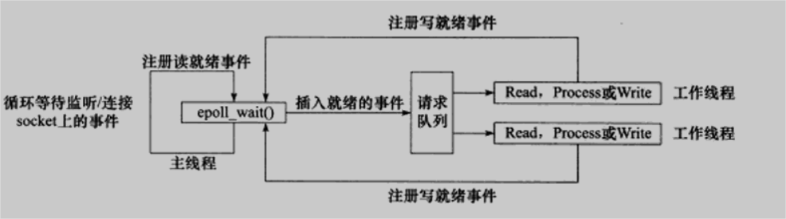
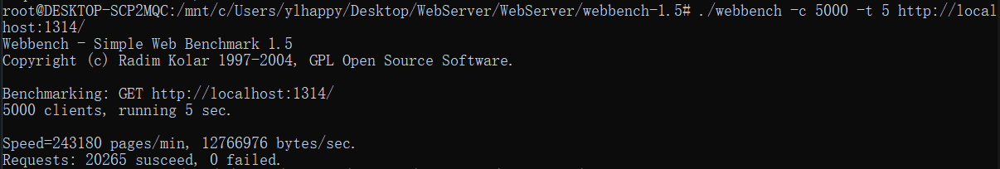
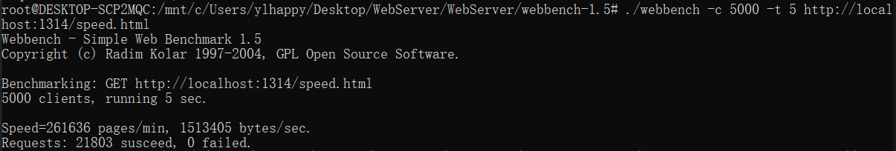

### WebServer


----

**使用C++17编写的轻量级高性能服务器，参考Linux高性能服务器编程（游双著）**
- **[阻塞队列](https://github.com/dhcpack/WebServer/tree/main/log)**：使用条件变量实现生产者消费者模式，使用互斥锁确保线程安全
- **[日志](https://github.com/dhcpack/WebServer/tree/main/log)**：借助阻塞队列实现异步日志，实现日志分级，日志格式参考IIS Web服务器默认格式
- **[线程池](https://github.com/dhcpack/WebServer/tree/main/threadpool)   [I/O复用](https://github.com/dhcpack/WebServer/tree/main/server)**：利用IO复用技术Epoll和线程池实现多线程的Reactor高并发模型
- **[数据库连接池](https://github.com/dhcpack/WebServer/tree/main/mysqlpool)**：实现数据库连接池，减少数据库连接建立和初始化的开销。利用RAII机制管理数据库连接的获取和释放。实现数据库连接的超时重连。
- **[定时器](https://github.com/dhcpack/WebServer/tree/main/timer)**：基于小根堆实现时间堆定时器，高效处理超时的非活动连接
- **[Http请求](https://github.com/dhcpack/WebServer/tree/main/http)**：使用状态机解析Http请求。可自定义并注册视图函数，也可处理对静态资源的请求
- **[Http响应](https://github.com/dhcpack/WebServer/tree/main/http)**：使用文件映射内存(mmap)，分散读、聚集写(iovec, readv, writev)加快响应速度
- **[配置文件](https://github.com/dhcpack/WebServer/tree/main/config)**：统一管理和自定义服务器的所有配置

----

### 环境
```cmake
cmake_minimum_required(VERSION 3.22) 
```
确保安装了`mysqlclient`链接库，可通过以下命令安装
```shell
sudo apt-get install libmysqlclient-dev
```
在`Config.h`中配置数据库和静态资源目录，若计划使用注册和登录功能需要在数据库建立user表：
```mysql
CREATE TABLE user(
    username char(50) NULL,
    password char(50) NULL
)ENGINE=InnoDB;
```

----

### 运行方法
Docker
拉取远程镜像
```bash
# 拉取镜像
docker pull mooneateryuelin/webserver:latest
# 新建容器并运行，映射到本机1314端口，通过localhost:1314访问
docker run --name WebServer -p 1314:1314 -d mooneateryuelin/webserver:latest
```

本地构建镜像
```bash
# 克隆项目
git clone git@github.com:dhcpack/WebServer.git
# 进入目录
cd WebServer
# 构建镜像
docker build -t webserver:v1 .
# 新建容器并运行，映射到本机1314端口，通过localhost:1314访问
docker run --name WebServer -p 1314:1314 -d webserver:v1
# 进入容器
docker exec -it WebServer /bin/bash
# 停止容器
docker stop WebServer 
```
cmake
```bash
# 克隆项目
git clone git@github.com:dhcpack/WebServer.git
# 进入目录
cd WebServer
# 修改Config.h
# 将33行*resourcesDir改为"/../resources";

# 生成构建目录
cmake -S . -B build
# 构建
cmake --build build
# 运行
cd build && ./WebServer
```
默认运行在1314端口

注意：仓库代码默认不开启数据库，若要使用注册和登录(与数据库相关)功能，请在Config.h中做好配置后运行项目

---

### 架构
#### Epoll + Reactor


**主线程只负责监听，工作线程做读写数据和处理客户端请求**

----

### 性能测试
```shell
./webbench -c 5000 -t 5 http://localhost:1314/
```


```shell
./webbench -c 5000 -t 5 http://localhost:1314/speed.html
```



----

### 网站
[Yuelin's WebServer](http://43.143.166.142:1314/)

----

### 参考
- Linux高性能服务器编程（游双著）
- [qinguoyi/TinyWebServer](https://github.com/qinguoyi/TinyWebServer/)
- [markparticle/WebServer](https://github.com/markparticle/WebServer)