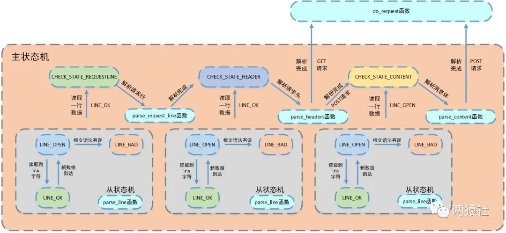

### Http请求
- 使用正则匹配，主从状态机解析Http请求报文

- 支持GET, POST请求，对于POST请求，支持`Content-Type = application/x-www-form-urlencoded`类型的请求体，后续可继续扩展(TODO)


### 用户自定义视图函数
- 抽离出自定义视图函数的接口，可在[userfunctions.cpp](https://github.com/dhcpack/WebServer/blob/main/http/userfunctions.cpp)中自定义并注册视图函数
- 视图函数的返回类型为`ResponseMessage`
    ```c++
    struct ResponseMessage {
        std::optional<std::string> html_path_;  // HTML(可选)
        HTTP_STATUS_CODE code_;  // 状态码
    };
    ```
- `ResponseMessage`还可扩展支持Json等类型的返回值(TODO)
- 可使用`MySqlManager`类，获取数据库连接，操作数据库。该类利用RAII机制，在构造和析构函数中分别实现从数据库连接池中获取和释放数据库连接，方便管理
    ```c++
    MYSQL *sql;
    MySqlManager manager(&sql);
    ```

### Http响应
- 使用文件映射内存(mmap)，分散读、聚集写(iovec, readv, writev)加快响应速度
- 若用户定义了视图函数，则以视图函数的返回信息作为响应信息
- 若没有查询到请求对应的视图函数，则在配置文件指定的位置寻找静态资源并返回
- 若不存在静态资源，则返回404 NOT FOUND


### Http响应流程


