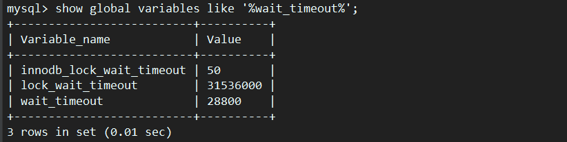
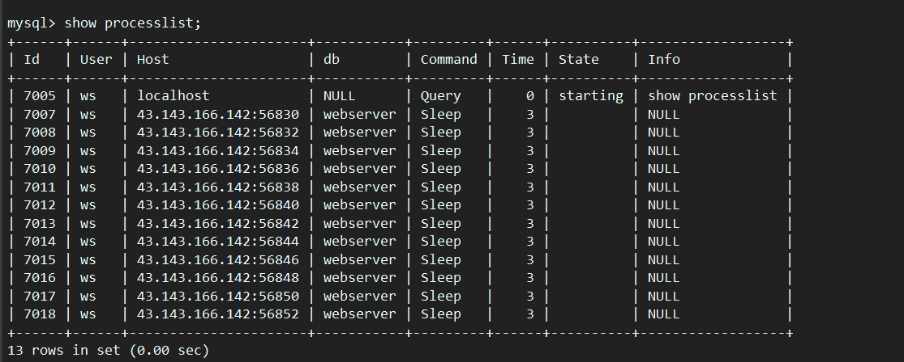

### 数据库连接池
- 使用队列保存数据库连接。当需要使用数据库连接时，从队首取出一个连接，用完后将连接插入到队尾
- 新建`MySqlManager`类利用RAII机制便捷管理数据库连接的获取和释放
    ```c++
    // MySqlPoll RAII
    class MySqlManager {
    public:
        explicit MySqlManager(MYSQL **sql) {
            *sql = MySqlPool::instance().getConn();
            sql_ = *sql;
        }
    
        ~MySqlManager() {
            MySqlPool::instance().freeConn(sql_);
        }
    
    private:
        MYSQL *sql_;
    };
    ```
- 数据库连接的超时重连。
  - 当数据库连接睡眠一段时间后，会被强行断开。可通过`show global variables like '%wait_timeout%';`查看
  
    这里超时的时间为28800s（8小时）
  - 当没有数据库请求时，数据库连接池的中的连接处于睡眠状态，超过8小时会被数据库强行断开。可通过`show processlist;`查看所有连接：
  
  - 当使用数据库连接但发现该连接已被数据库超时断开时，会进行重新连接，保障数据库的可用。
  ```c++
    // 连接超时，重连
    if (mysql_ping(sql) != 0) {
        mysql_close(sql);
        if ((sql = mysql_init(nullptr)) == nullptr) {  // 连接
            connQueue_.push(sql);
            return nullptr;
        }
        if ((mysql_real_connect(sql, host_, user_, pwd_, dbName_, port_, nullptr, 0)) == nullptr) {  // 初始化
            connQueue_.push(sql);
            return nullptr;
        }
        LOG_DEBUG("MySql Reconnection!\n");
    } 
  ```