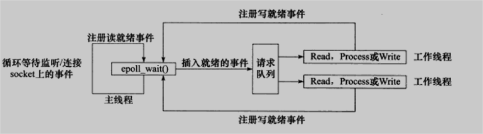

### 服务器

- 基于epoll同步I/O实现的Reactor事件处理模式

1. 主线程往epoll内核事件表中注册socket上的读就绪事件。
2. 主线程调用epoll_wait等待socket上有数据可读。
3. 当socket上有数据可读时，epoll_wait通知主线程。主线程则将socket可读事件放入[任务池](https://github.com/dhcpack/WebServer/tree/main/threadpool)。
4. 睡眠的某个工作线程被唤醒，它从socket读取数据，并处理客户请求，然后往epoll内核事件表中注册该socket上的写就绪事件。
5. 主线程调用epoll_wait等待socket可写。
6. 当socket可写时，epoll_wait通知主线程。主线程将socket可写事件放入[任务池](https://github.com/dhcpack/WebServer/tree/main/threadpool)。
7. 睡眠的某个工作线程被唤醒，它往socket上写入服务器处理客户请求的结果。

**主线程只负责监听，工作线程做读写数据和处理客户端请求**

